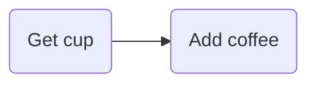
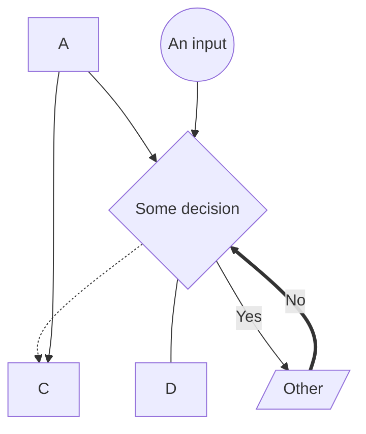
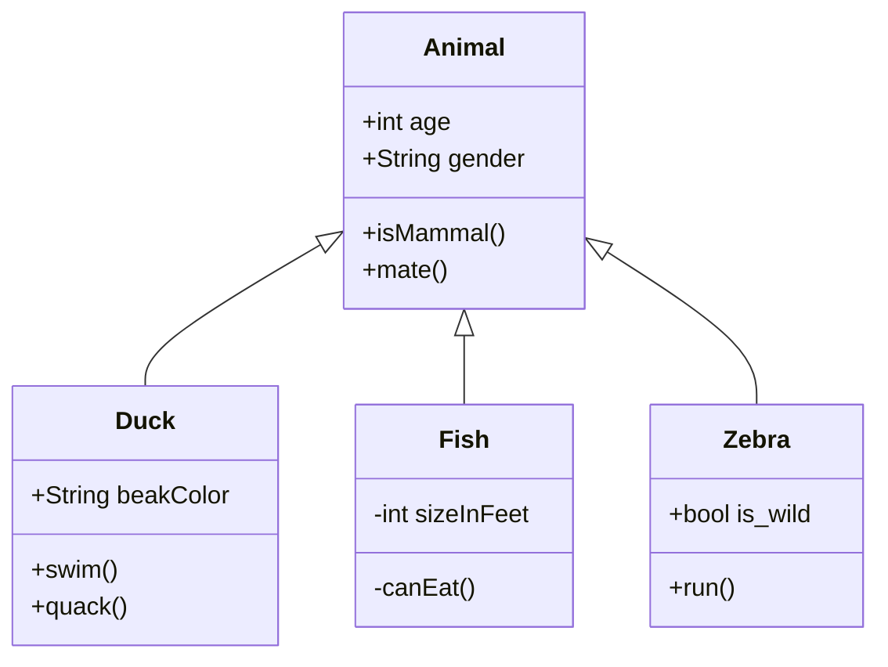
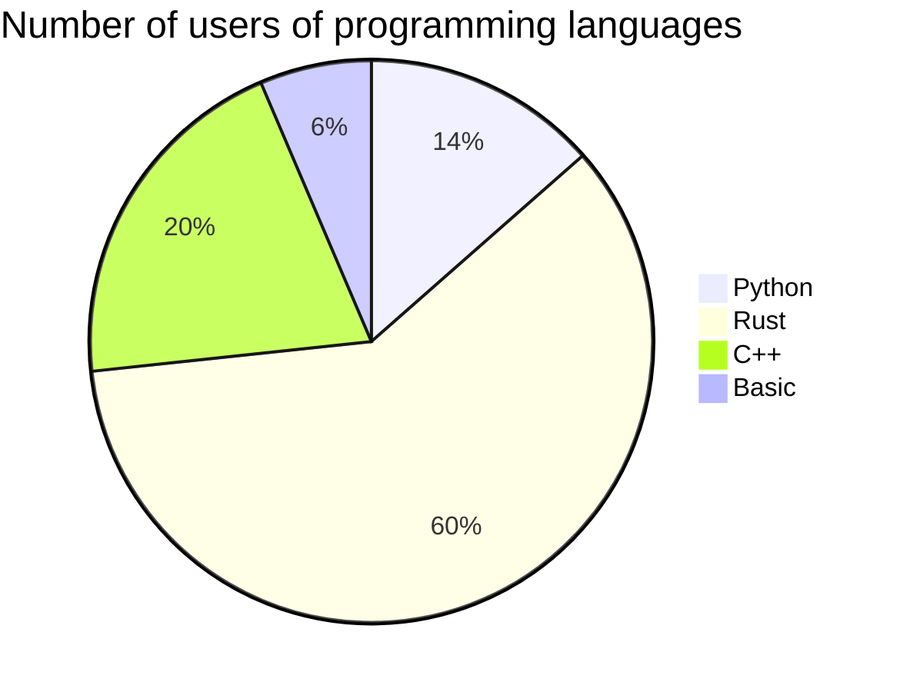
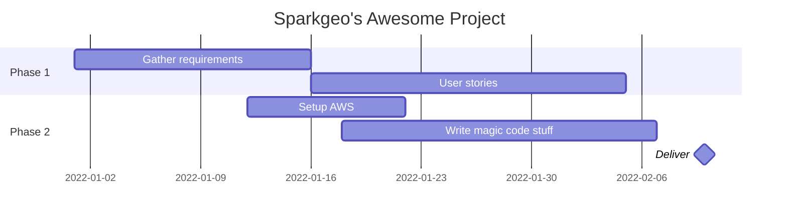

# Tea and Teach: Mermaid

## What is Mermaid
Mermaid lets you create diagrams and visualizations using text and code.

It is a Javascript based diagramming and charting tool that renders Markdown-inspired text definitions to create and modify diagrams dynamically.

Basically, you can draw diagrams in Markdown.

## Why should you care?
* It's fun and useful
* It's easy to learn
* It renders in Github so you can take your repo README to the next level
* It's easily modifiable so diagram updates are quick

## Install and run
- [Mermaid Live Editor](https://mermaid.live/) - an online editor 
- VS Code Extensions
    - *Markdown Preview Mermaid Support* -  Adds Mermaid diagram and flowchart support to VS Code's builtin markdown preview
    - *vscode-mermaid-syntax-highlight* - Syntax support for the Mermaid charting language
    - List of [extensions with Mermaid support](https://marketplace.visualstudio.com/search?term=mermaid&target=VSCode&category=All%20categories&sortBy=Relevance)
- Github - just edit a .md file

## Syntax
Use the following:
    `` 
    ```mermaid <some markdown>
    ``` 
    `` to define your drawing

Add in stuff about styles

## Chart types
### graph


- Can change the direction of the graph: LR, RL, TB, BT 
- Can label the arrow using | |
- Can extend arrow length
- Can change arrow endings: --o --> --- ==> -.-->
- Can change shapes when adding labels: () [] {} (()) ([])   


A more complex example


### Class diagram
Maybe of more use when describing the workings of code is the class diagram.

In the diagram shown here, the relationships between Animal and Duck/Fish/Zebra are defined, before the properties of the classes. Using a `class` method means that specific parameters can be added and defined per class. 



### Pie charts

These are super easy - Mermaid renders the percentage and the legend automatically. 

`showData` is optional and does just that 



### Gantt charts

Relatively simple to change the section names, dates and task names.



# What now?
Look at the [docs](https://mermaid-js.github.io/mermaid/#/) as they are very comprehensive

Play around.